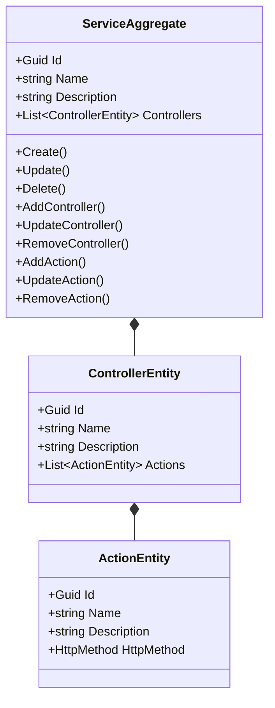
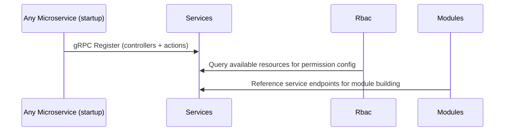

# Services Microservice

## Overview

The Services microservice is the physical service registry of the platform. Each microservice auto-registers its identity (name, description) and its API surface (controllers and their actions with HTTP methods) at startup. This registry enables the RBAC system to know what resources exist for permission configuration, and provides administration UIs with a live inventory of all deployed microservices and their endpoints.

## Business Context

In a microservices architecture with dozens of services, each exposing multiple controllers and actions, keeping track of what API endpoints exist is a challenge. Without a service registry, administrators configuring RBAC permissions would need to manually maintain a list of every controller and action across every microservice -- a process that is error-prone and quickly becomes stale as services evolve.

The Services microservice solves this by receiving automatic registrations from each microservice at startup (via gRPC). When a microservice boots, it introspects its own controllers, discovers their actions and HTTP methods, and registers them here. The result is an always-current inventory of the platform's API surface that RBAC and Modules can reference.

For a new developer: this is the "phone directory" of microservices. It knows every service that is deployed and every endpoint each one exposes.

## Ubiquitous Language

| Term            | Definition                                                                                                                       |
| --------------- | -------------------------------------------------------------------------------------------------------------------------------- |
| Service         | A deployed microservice in the platform. Identified by a unique ID, name, and description.                                       |
| Controller      | A REST controller within a service that groups related API endpoints (e.g., "VehiclesController", "InvoiceController").           |
| Action          | A specific HTTP endpoint within a controller (e.g., "Create", "GetAll", "Delete", "Issue").                                       |
| HttpMethod      | The HTTP verb for an action: Get, Post, Put, Delete, Patch.                                                                       |
| Registration    | The process by which a microservice announces its controllers and actions to this registry at startup.                             |
| Auto-Discovery  | The mechanism that introspects a microservice's controller metadata to build the registration payload automatically.              |
| AddController   | The operation that adds a new controller to a service's registry. Idempotent: skips if controller name already exists.            |
| AddAction       | The operation that adds a new action to a controller. Idempotent: skips if action name already exists within the controller.      |
| RemoveController| The operation that removes a controller from a service's registry.                                                                 |
| RemoveAction    | The operation that removes an action from a controller.                                                                            |
| UpdateController| The operation that modifies a controller's name or description.                                                                    |
| UpdateAction    | The operation that modifies an action's name, description, or HTTP method.                                                         |
| API Surface     | The complete set of all controllers and actions exposed by all registered microservices.                                           |
| ControllerEntity| The entity class representing a controller within a service, containing a list of ActionEntity entries.                           |
| ActionEntity    | The entity class representing a single action within a controller.                                                                 |
| Idempotent Registration | The guarantee that re-registering the same controller/action has no side effects, supporting safe restarts.                |

## Domain Model

The Services domain is organized around a single aggregate. The `ServiceAggregate` represents a deployed microservice and contains a hierarchical list of controllers, each containing their actions. This two-level nesting mirrors the physical structure of a REST API.

## Data Dictionary

### ServiceAggregate

Represents a deployed microservice and its API surface.

| Field       | Type                     | Description                                  |
| ----------- | ------------------------ | -------------------------------------------- |
| Id          | Guid                     | Unique identifier of the service             |
| Name        | string                   | Service name (e.g., "ms-vehicles")           |
| Description | string                   | Description of the service's purpose         |
| Controllers | List\<ControllerEntity\> | Controllers exposed by this service          |
| IsActive    | bool                     | Whether the service is currently deployed    |
| CreatedBy   | Guid                     | System or user that registered the service   |
| CreatedAt   | Instant                  | UTC timestamp of creation                    |

### ControllerEntity

A REST controller within a service.

| Field       | Type                 | Description                               |
| ----------- | -------------------- | ----------------------------------------- |
| Id          | Guid                 | Unique identifier of the controller       |
| Name        | string               | Controller name (e.g., "Vehicles")        |
| Description | string               | Description of the controller's purpose   |
| Actions     | List\<ActionEntity\> | Actions exposed by this controller        |

### ActionEntity

A single API endpoint within a controller.

| Field       | Type       | Description                                |
| ----------- | ---------- | ------------------------------------------ |
| Id          | Guid       | Unique identifier of the action            |
| Name        | string     | Action name (e.g., "Create", "GetAll")     |
| Description | string     | Description of what the action does        |
| HttpMethod  | HttpMethod | HTTP verb: Get, Post, Put, Delete, Patch   |

## Integration Architecture

Services receives registrations from all microservices at startup and is queried by RBAC and Modules for resource enumeration.

## Event Catalog

### Events Produced

| Event                        | Trigger              | Purpose                                     |
| ---------------------------- | -------------------- | ------------------------------------------- |
| `ServiceCreatedDomainEvent`  | `Create()`           | New microservice registered                 |
| `ServiceUpdatedDomainEvent`  | `Update()`           | Service metadata changed                    |
| `ServiceDeletedDomainEvent`  | `Delete()`           | Service deregistered                        |
| `ControllerAddedDomainEvent` | `AddController()`    | New controller registered in a service      |
| `ControllerUpdatedDomainEvent`| `UpdateController()`| Controller metadata changed                 |
| `ControllerRemovedDomainEvent`| `RemoveController()`| Controller removed from registry            |
| `ActionAddedDomainEvent`     | `AddAction()`        | New action registered in a controller       |
| `ActionUpdatedDomainEvent`   | `UpdateAction()`     | Action metadata changed                     |
| `ActionRemovedDomainEvent`   | `RemoveAction()`     | Action removed from registry                |

## API Reference

Base path: `/api`

### Services

| Method | Path                                                            | Description                              | Auth    |
| ------ | --------------------------------------------------------------- | ---------------------------------------- | ------- |
| GET    | `/api/Service`                                                  | Paginated list of services               | Bearer  |
| GET    | `/api/Service/{id}`                                             | Get a service with controllers/actions   | Bearer  |
| POST   | `/api/Service`                                                  | Register a new service                   | Bearer  |
| PUT    | `/api/Service/{id}`                                             | Update service metadata                  | Bearer  |
| DELETE | `/api/Service/{id}`                                             | Deregister a service                     | Bearer  |
| POST   | `/api/Service/{id}/controller`                                  | Add a controller                         | Bearer  |
| PUT    | `/api/Service/{id}/controller/{controllerId}`                   | Update a controller                      | Bearer  |
| DELETE | `/api/Service/{id}/controller/{controllerId}`                   | Remove a controller                      | Bearer  |
| POST   | `/api/Service/{id}/controller/{controllerId}/action`            | Add an action                            | Bearer  |
| PUT    | `/api/Service/{id}/controller/{controllerId}/action/{actionId}` | Update an action                         | Bearer  |
| DELETE | `/api/Service/{id}/controller/{controllerId}/action/{actionId}` | Remove an action                         | Bearer  |

### gRPC Services

| Service          | Method              | Description                                      |
| ---------------- | ------------------- | ------------------------------------------------ |
| ServiceRegistry  | RegisterService     | Register/update a service with its full API surface |

All REST endpoints return RFC 7807 Problem Details on error.

## Key Design Decisions

- **Idempotent registration:** AddController and AddAction check for existing entries by name before adding. This allows microservices to safely re-register on every restart without creating duplicates.

- **Two-level nesting:** Controllers contain actions rather than a flat list, mirroring the physical REST API structure and enabling the RBAC UI to display resources hierarchically.

- **No tenant scoping:** The service registry is global platform infrastructure. All microservices register once regardless of how many tenants exist.

- **gRPC for automated registration:** Microservices use gRPC at startup for efficient batch registration of their entire API surface in a single call.

- **Separation from Modules:** Services tracks physical microservice endpoints; Modules tracks logical feature groupings. A module may span multiple services, and a service may contribute to multiple modules.

## Related Microservices

| Microservice     | Direction | Integration Point                                                    |
| ---------------- | --------- | -------------------------------------------------------------------- |
| All Microservices| Inbound   | Auto-register their controllers/actions at startup via gRPC          |
| Rbac             | Outbound  | Queries service registry for resource enumeration in permission config|
| Modules          | Outbound  | References service endpoints when building module definitions        |
